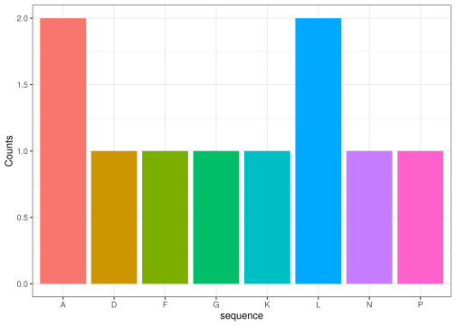

<!-- README.md is generated from README.Rmd. Please edit that file -->

``` r
library(dogmarep)
```

# dogmarep

<!-- badges: start -->
<!-- badges: end -->

The goal of dogmarep is to …

## Installation

You can install the development version of dogmarep from
[GitHub](https://github.com/) with:

``` r
# install.packages("pak")
pak::pak("rforbiodatascience25/group_01_package")
```

## Example

DogmaRep is able to compute an example conversion from DNA to RNA to AA
sequence, with the possibility of plotting the peptide sequence as well.

### Generating random nucleotide sequence

You can obtain a random nucleotide sequence of given length, by using
the `generate_nucleotides` function.

``` r
DNA_seq <- generate_nucleotides(seq_size = 30)
DNA_seq
#> [1] "GGCGCACTCAAGCTGAATCCCTTCGCAGAC"
```

### Converting from DNA to RNA

The `dna_to_rna()` function can be used to convert DNA sequences to an
RNA sequence.

``` r
RNA_seq <- dna_to_rna(DNA_seq)
RNA_seq
#> [1] "GGCGCACUCAAGCUGAAUCCCUUCGCAGAC"
```

Notice that the thymines are subsituted with uracil

### Split RNA into codons

In order to prepare the RNA sequence for translation into a peptide
sequence, use the `codon_splitter()` function to split the sequence into
3s (specific for codons).

``` r
codons <- codon_splitter(RNA_seq)
codons
#>  [1] "GGC" "GCA" "CUC" "AAG" "CUG" "AAU" "CCC" "UUC" "GCA" "GAC"
```

### Translating codons to amino acids (peptide sequence)

A list of codons (as strings) can be supplied to the function
`codon_to_letter()`, in order to generate a contionous peptide sequence
with corresponding amino acids. The function relies on the codon to
amino acid lookup table, object named `codon_table` generated in
R/data.R

``` r
peptide_seq <- codon_to_letter(codons)
peptide_seq
#> [1] "GALKLNPFAD"
```

### Plotting peptide sequences

Finally, the amount of amino acids in the peptides can be visualized
using `AA_plot()`, which is a function that generates a barplot of each
found amino acid.

``` r
AA_plot(peptide_seq)
```


